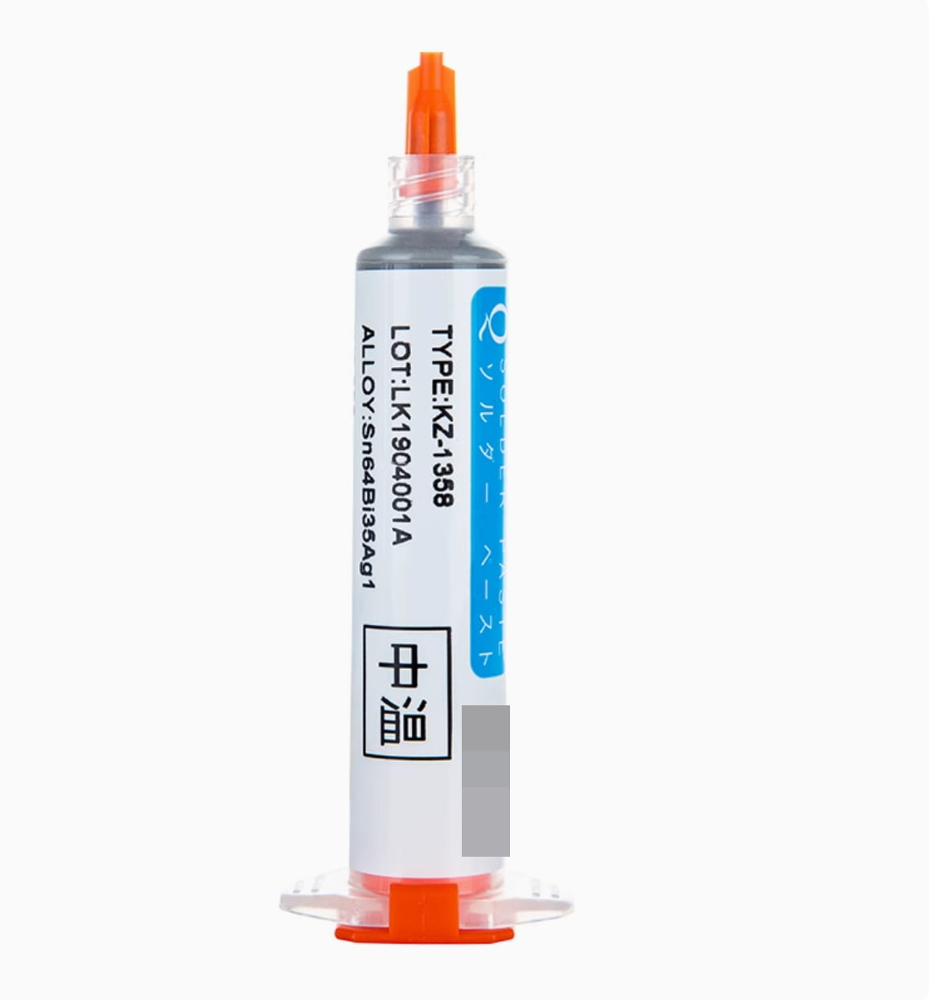

# PixelClock像素时钟(二) 材料和工具

## 目录

### 外壳(包含外壳 格栅 后盖 组装辅助架)

- 外壳
  - 外壳尺寸200 * 45 * 55mm(长 宽 高)
  - 可安装192mm*48mm 的灯板
- 黑色格栅
- 后盖(三种样式可选)
  - 默认后盖
  - 圆形后盖
  - 四叶草后盖
- 组装辅助架
  - 作用一: 压螺母时平衡
  - 作用二: 固定涂了粘胶的亚克力板
- 闲鱼购买地址
  - https://m.tb.cn/h.gHUBSjD?tk=fwsg3jWDiOH MF6563 
  - 
- 微信小程序闲鱼地址(发送聊天框后点击打开)
  - #小程序://闲鱼/iRA7n3rfED1g1ly

### 亚克克力板

- 193.4 * 49.4 * 1.5mm(长 宽 高), 浅黑灰透明(或灰色透明)
- 请勿购买黑色透明亚克力板, 安装后灯珠很暗
- 10元左右
- 闲鱼购买地址
  - https://m.tb.cn/h.gsxD4fk?tk=1ouA3j3abMz HU9046
  - 
- 微信小程序闲鱼地址(发送聊天框后点击打开)
  - #小程序://闲鱼/4pmT8ctkTnA5hgn

### 均光纸

- 193.4 * 49.4
- A4纸
- 或均光膜 10元左右
- 或贴车的膜 10元左右
- 购买外壳或亚克力板会送大家裁剪好的均光膜

### 灯板与灯珠PCB

- 灯珠 WS2812B 可编程 35*28规格 幻彩灯珠 至少256颗
  - 0.08*270 = 21.6 元左右
- 灯板PCB 96mm*48mm  两块(每块可安装灯珠16*8 =  128个灯珠)
  - 免费打样
- 焊接灯板工具
  - 中温(或高温)针筒锡膏至少30克
    - 
    - (有条件可用无铅锡膏, 上图是示例针筒锡膏)
    - 无铅中温针筒锡膏价格35元左右(50克样子)
    - 无钢网需要购买针筒锡膏
    - 有钢网针筒 瓶装都可
  - 加热板(或加热台)
    - 鹿仙子加热板(20元左右, 稍微有点不安全, 加热快1-2分钟)
    - 或数显加热台(140元左右, 安全,加热5分钟)
  - 滴锡
    - 手工一个一个灯珠去滴锡膏
    - 或钢网10cm * 10cm, 0.18或0.2 mm厚(20元左右)
      - 闲鱼购买地址
        - https://m.tb.cn/h.gH52CCU?tk=IWeW3j3YzJC CZ3452)
        - 
      - 微信小程序闲鱼地址(发送聊天框后点击打开)
        - #小程序://闲鱼/srCXz1jzhugie3n
    - 另有提供钢网固定台8元/个
- PCB地址和Gerber文件
  - 立创开源PCB地址
    - https://oshwhub.com/lixiaoming1988/pixelclock-xiang-su-shi-zhong-kai-yuan-pix24-o
  - Gerber文件下载(Gerber文件夹内)
    - https://gitee.com/leezicai/PixelClock
    - https://github.com/leezicai/PixelClock

### 主控制PCB

- 尺寸48 * 95.8 mm
- 感谢免费打板
  - 嘉立创 www.jlc.com
  - 捷配 www.jiepei.com
- PCB地址和Gerber文件
  - 立创开源PCB地址
    - https://oshwhub.com/lixiaoming1988/pixelclock-xiang-su-shi-zhong-kai-yuan-pix24-o
  - Gerber文件下载(Gerber文件夹内)
    - https://gitee.com/leezicai/PixelClock
    - https://github.com/leezicai/PixelClock

### 主板元件

- ESP32-C3开发版
  - 未焊接排针
  - 简约款(或经典款)
  - 15元 左右
  - 淘宝商家购买地址
    - 一般不放商家链接上来, 放上来买的多了就离谱涨价
    - 芯片生产商不同会有兼容性问题
    - 这家有买过 测试安装后可用
    - http://e.tb.cn/h.gvevOmTmyWt9uIH?tk=9Sv23l7kV6M HU9196
- Type-C母座
- Type-C母座
  - 3元/ 5 个
  - 至少5个吧, 容易焊坏
  - 6.8mm 高
  - 6P 立贴
- 电阻
  - 贴片电阻封装都是0805规格
  - 电阻10k * 1, 规格0805, 2元/100个
  - 电阻5.1k * 2, 规格0805, 2元/100个
- 矮体 无源蜂鸣器 16欧
  - 矮体无源蜂鸣器  2元/5个
  - 蜂鸣器高6.5mm 引脚长5mm 
- MAX9814 麦克风模块 10元左右
- 光敏电阻 GL5506 , 3元 / 5个

### 其他

- 胶水
  - 706胶水4元左右
- 平头螺丝 * 8 
  - M1.6 * 5 * 3 (直径 杆长 头部宽)
  - 3元 / 100个
- 通孔铜螺母 * 8
  - M1.6 * 3 * 2.5 (内径 高度 外径)
  - 3元 / 20个
- 金属开关
  - 平头圆形白灯 自锁 16mm * 1个, 5元/个
    - 3-9v
    - 圆形白灯
    - 平头
    - 自锁
    - (也能选择其他颜色的灯)
  - 不带灯 高头 复位 12mm * 3个, 2元/个
    - 3-6v
    - 不带灯
    - 高头
    - 复位
- 双头镀锡线
  - 15cm 厘米
    - 22AWG或24AWG
    - 3种颜色以上区分(红 黑 蓝)
    - 8元 / 100根(3种颜色 24元左右)
  - 5cm 厘米
    - 22AWG或24AWG
    - 单一颜色即可
    - 5元 / 100根
- 助焊膏
  - 非必须
  - 10ml
  - 我的买YG-338
  - 10元左右
- 螺丝刀
  - PH0 螺丝刀
  - 或1.5mm  十字螺丝刀
- 美术刀
  - 剪均光纸
  - 6元左右
- 剪刀
  - 剪光敏电阻引脚
- 镊子
  - 静电镊子
  - 5元左右
- 无铅锡丝(或有铅锡丝)
  - 20克以上
  - 20元左右
- 杜邦线 * 10根
  - 作用: 测试灯珠使用
  - 公对母
  - 3元/30根
- 美纹胶
  - 非必须
  - 作用: 粘亚克力板时防止涂到外壳上
  - 5元 / 卷
- 万用电表 
  - 非必须
  - 作用: 量Type-C是否焊好
  - 20 元左右
- 口罩
  - 防止吸入锡烟
- 电脑浏览器
  - 写入固件使用

### 电烙铁参考

- 作用: 焊接和压入螺母
- 电烙铁(外热式) 15元左右
- 电烙铁(内热式) 30元左右
- T12 电烙铁 120元左右
