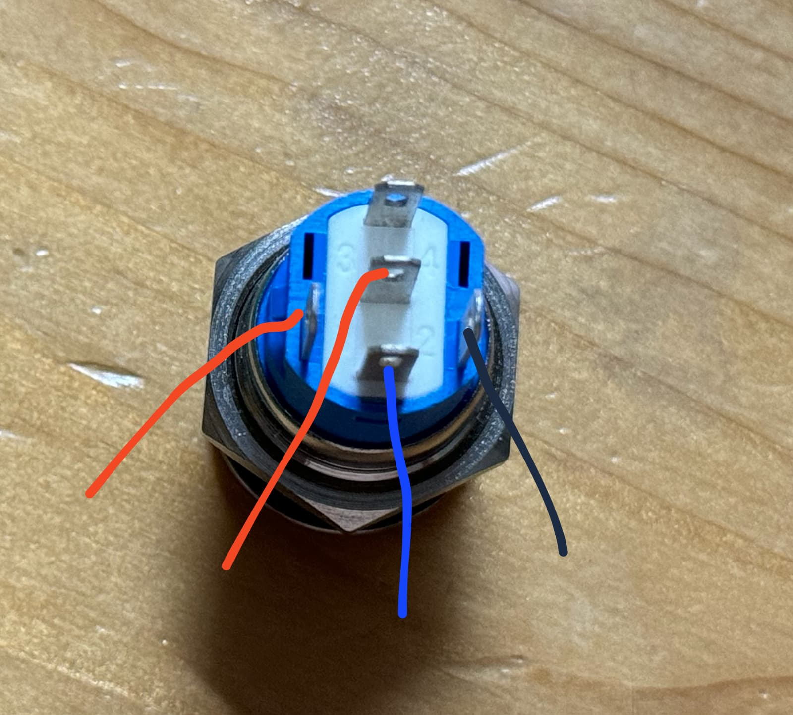
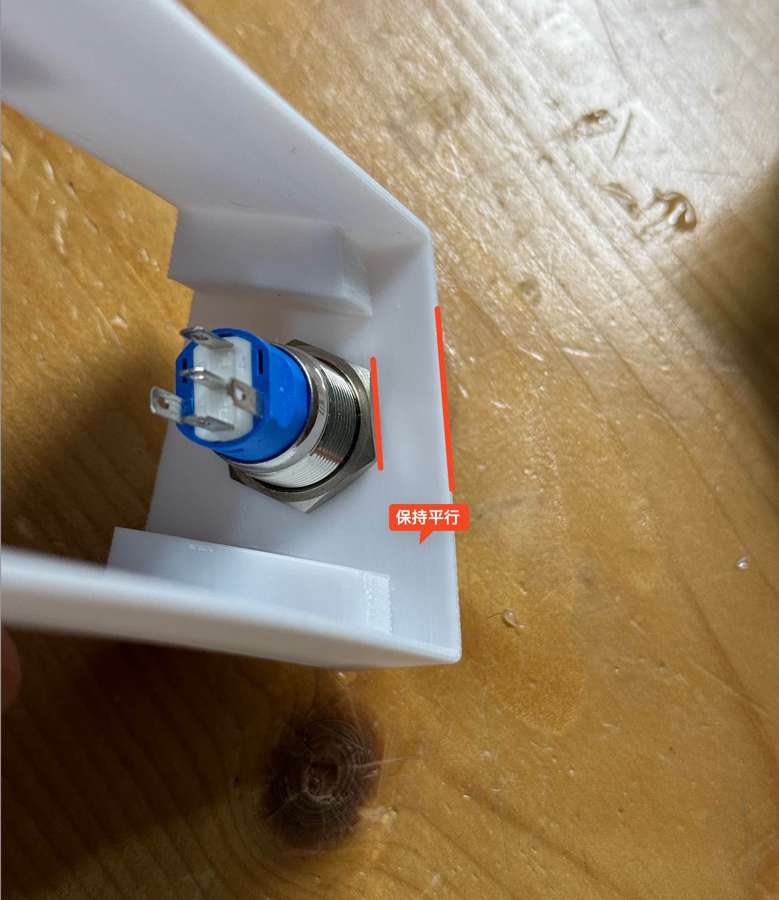
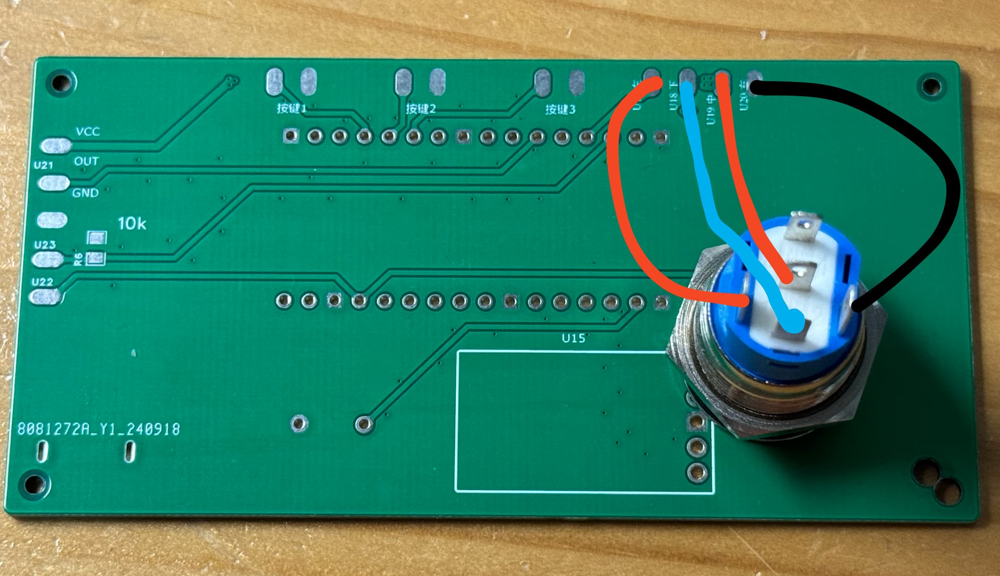
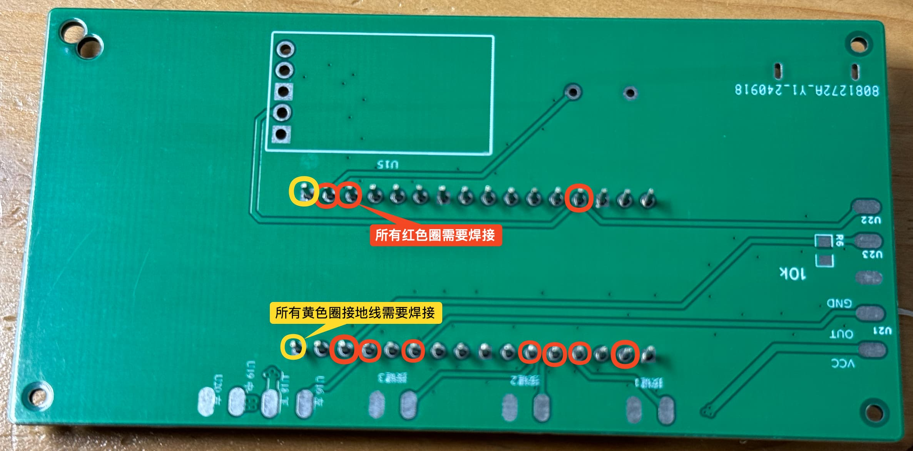
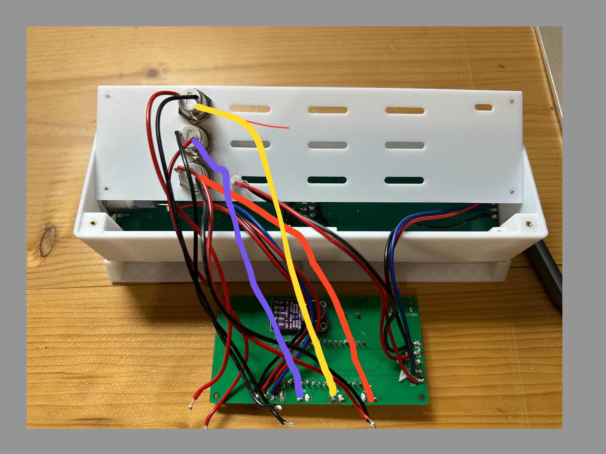

# PixelClock像素时钟(四) 焊接和组装

## 目录

### 焊接前的信息

- 开窗
- 戴口罩 😷
- 电铬铁焊接的温度
  - 中温锡膏 240度
  - 锡线高温 300度
  - 压螺母 300度或350度

### 焊接和粘光敏元件到后盖上

- 剥线(剥掉一头的线)
- 线缠绕在光敏引脚上
- 涂锡膏, 2根线焊接光敏元件
- 剪掉一部分光敏元件引脚
- 光敏元件按在后盖上, 并用706粘住, 放在一边凝固

### 按钮

- 锡丝 (中温 高温锡膏也行)
- 3个12mm 高头按钮
  - 拧上螺母(这样焊接的时候不会滚动)
  - 只焊接接按钮端的2根线
  - 拧下螺母
  - 装到后盖上并拧上螺母
- 1个16mm 圆形带灯平台按钮
  - 拧上螺母(这样焊接的时候不会滚动)
  - 
  - 只接按钮端的4根线, 接线方式如上(红色代表VCC 蓝色信号线 黑色GND)
  - 
  - 拧下螺母装到外壳上, 再次拧上螺母, 螺母拧的角度如上

### 焊接ESP32C3针脚

- 针脚放到主板PCB上
- EPS32 C3放到针脚上
- 锡膏焊接(或先加助焊剂再加锡来焊接)
- 写入测试程序(请参考PixelClock 三)

### 压入螺母

- 外壳放在压螺母支架上
  - 支架
- 拧好M1.6螺丝和M1.6铜螺母
  - 
  - 保持螺丝最长端刚刚好在螺母内
- 烙铁300度或350度
- 
- 扣好PCB到后盖处, 依次压入4个螺母(如上图, 使用主板上孔洞完成压入螺母)
- 扣好PCB到本来放置位置, 依次压次4个螺母(也可以只装对角的2个螺母)

### 焊接灯珠

- 中温锡膏(或高温锡膏)
- 两种方式
  - 手剂锡膏到灯板PCB上
  - 钢网
- 放置灯珠
  - 左上角有1 与 灯珠的缺角也保持左上角
  - 
- 放到加热台
  - 完全熔化即可拿下来
- 测试灯板
  - 使用杜邦线(公对母 15CM长度)
  - 
  - 连接ESP32-C3 GND 5V I006
  - 灯板 GDN VCC IN
- 如果灯珠不亮
  - 检查不亮的灯和不亮灯前面一个灯是否连锡或虚焊
- 连接灯板再次测试
  - 连接灯板
  - 连接灯板和ESP32-C3

### 主板PCB

- 注意
  - PCB板上焊接, 推荐中温锡膏
  - 原因: 焊坏PCB板子也容易拆下来元件
- Type-C母座
  - 中温锡膏 (低温都可), 这里推荐用锡膏
  - 先预热PCB板子(重要, 放加热台上5秒钟,再拿下来)
    - 立即涂上PCB板子Type-C处, 锡膏自动扩散薄薄一层
    - 如果多了, 擦掉重新预热再涂
    - 最边上固定Type-C母座2个孔洞也要涂上, 这里可以多涂一点
  - 如果有少部分连锡, 加一些助焊膏
  - 再放上Typc-C母座, 放到加热台上, 熔化锡膏即可
- 测试 Type-C母座
  - 方式一
    - 主板PCB连接16mm平头按钮, 并按下按钮
      - 连接点PCB左 下 中 右对应平头按钮4根线
      - 
    - 通电, 插入Type-C 母座
    - 用镊子连接2根红色电源线，如果灯亮就是Type-母座焊接好了, 否则重新焊接Type-C母座
  - 方式二
    - 万用表可以测相邻引脚无短路, 且与PCB有连接
- ESP32-C3焊接
  - 长的金属针插入PCB
  - 
  - PCB与ESP-C3有线引出的焊接(也可以所有引脚都焊接)
  - GND引脚焊接
- 5.1k电阻
  - 2个贴片电阻位置加锡膏
  - 放入加热台(用铬铁也可)
- 10k电阻
  - 1个贴片电阻位置加锡膏
  - 电铬铁焊接
- 无源蜂鸣器
  - +(正)号在左
  - 与PCB焊接
- 拾音模块
  - 先连接针脚
    - 短的金属针在传感器 同一侧
    - 焊接 短金属针与传感器
  - 长的金属针再插入PCB
  - 与PCB焊接

### 连接按钮 灯板线

- 连接主板与按钮线
  - 外壳有螺丝面朝上且16mm按钮在左, 拾音模块在上方
  - 
  - 俯视时, 从左到右, 按钮3 按钮2 按钮1,  对应后盖上按钮中 下 上
  - 注意点
    - 焊接注意连接线是偏向主板侧
- 连接主板和电源灯的线(如果已连接就跳过此步骤)
  - 左下中右的方式连接
- 连接主板与灯板线
  - 三根线连接灯板
  - 灯珠一面朝下, 且有VCC GND IN 在右
  - 连接到主控制板上
- 连接光敏元件
  - 焊接10k电阻的2根线就可以

### 测试连线正常

- 插入ESP32-C3上的Type-C供电
- 灯正常亮说明接线正确
  - 此时ESP32-C3 是测试灯珠的程序, 会依次点亮灯珠
- 然后刷入固件
- 按下ESP32-C3上的RST按钮会重启
- 启动会显示START
- 随后显示PIX10.0.0.1
  - 表示正常

### 粘合亚力克板 均光膜 灯板

- 撕下美纹胶 缠绕屏幕(亚克力板)周围的外壳, 防止706粘到外壳上不好清理
- 保持格栅和均光膜干净
- 灯板扣到光栅上
- 放上均光膜
- 亚力克板只撕一面, 撕掉的一面贴合均光膜
- 这里检查一下亚克力板轻轻按压就能刚好在外壳内
  - 如果不是
    - 用刮刀清理放灯板的平面上3D打印残留的
    - 检查电源按钮螺母边要和亚克力板平行
- 均匀的涂上706胶
- 用辅助支架压着亚克力板, 重物压着2小时
- 按住亚克力板 拆下辅助支架

### 拧螺丝

- 拧上主PCB的螺丝
- 宁上后盖上的螺丝

### 最后

- 插电
- 手机或电脑连接名称为PIX的WiFi
  - 连接成功后, 访问
    - 10.0.0.1
  - 选择家中WiFi和填入密码
  - 点击 提交
- 最后撕掉美纹胶带和亚力克板的膜
  - 可用湿纸币清理多余706
- 当当当! 组装完成了! ✅
