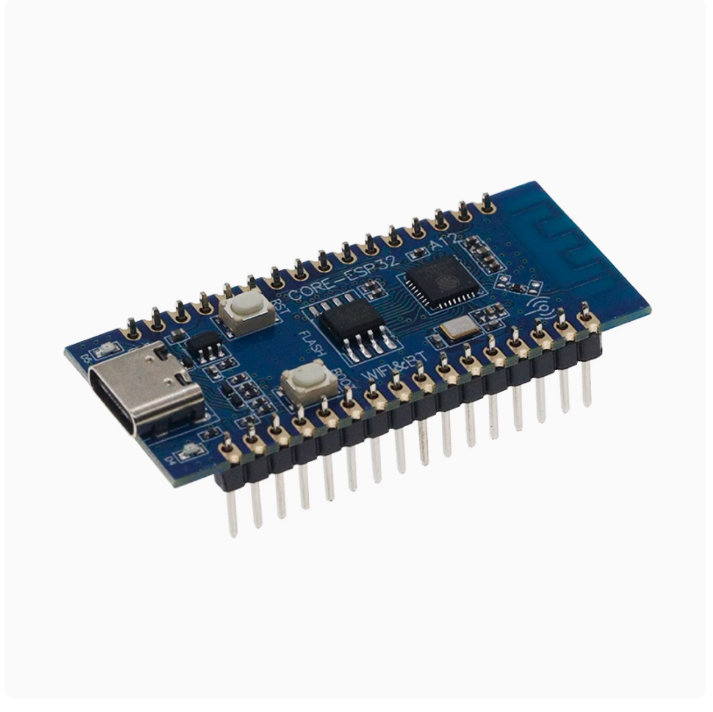

# PixelClock ピクセルクロックG2 (その1)
材料とツール

## 目次

### 購入リンクについて
- 閑魚のリンクは本人です、ケースの購入を歓迎します
- 淘宝のリンクはすべて業者です
	- 参考用のみ
	- 偽造チップか分解チップか区別できません
	- 品質を区別できません
	- 使える、安価としか言えません

### ケース (ケース、グリル、裏蓋を含む)
- ケース
	- ケースサイズ 200 * 45 * 55mm (長さ * 幅 * 高さ)
	- 192mm*48mmのライトボードを設置可能
- 黒いグリル
- 裏蓋のスタイル
	- デフォルトの裏蓋
- 組み立て補助スタンド (必須ではありません)
	- 役割1: ナットを押し込む際のバランスを取る
	- 役割2: 接着剤を塗ったアクリル板を固定する
- MakeWorld アドレス
	- 2種類のケース、自由に選択可能 商用利用禁止、個人利用無料
	- https://linkqr.org/lizicai/pixelclock-g2-3d-1
	- https://linkqr.org/lizicai/pixelclock-g2-3d-2
- 閑魚 購入アドレス
	- https://linkqr.org/lizicai/pixelclock-g2-xianyu-shell
	- https://linkqr.org/lizicai/pixelclock-g2-xianyu-shell-2

### アクリル板
- 193.4 * 49.4 * 1.5mm (長さ * 幅 * 高さ)、薄い黒灰色透明 (または灰色透明)
- 黒い透明アクリル板は購入しないでください、設置後にLEDが非常に暗くなります
- 10元前後
- 閑魚 購入アドレス
	- https://linkqr.org/lizicai/pixelclock-g2-xianyu-yakeli

### 拡散紙
- 193.4 * 49.4
- 拡散フィルム、10元前後。モデルはLGT075-J
- またはA4用紙 (長く使用すると黄変する可能性があります)
- または車のフィルム、10元前後
- ケースまたはアクリル板をご購入の方には、カット済みの拡散フィルムを差し上げます

### LEDボードとLED PCB
- はんだ付け済みのLEDとLEDボード
	- 購入アドレス
		- https://linkqr.org/lizicai/pixelclock-g2-xianyu-pixel-16-8
- LED WS2812B プログラマブル 35*28パッケージ フルカラーLED、少なくとも256個
	- 0.08*270 = 21.6元前後
	- 購入アドレス
		- http://e.tb.cn/h.T3hHdYBXYXhUKcF?tk=Or1N3v6kNsx
- LEDボードPCB 96mm*48mm 2枚 (各ボードに16*8 = 128個のLEDを設置可能)
	- 無料試作
- LEDボード はんだ付けツール
	- 中温 (または高温) シリンジはんだペースト
		- 
		- (条件が許せば鉛フリーはんだペーストを使用できます、上図はシリンジはんだペーストの例です)
		- 鉛フリー中温シリンジはんだペーストの価格は35元前後 (約50グラム)
		- メタルマスクがない場合はシリンジはんだペーストを購入する必要があります
		- メタルマスクがある場合はシリンジ、ボトル入りどちらでも可
		- 購入リンク
			- http://e.tb.cn/h.T0mzJe1TWx3MyVd?tk=5OpI3rmIcAk
	- ヒートプレート (またはホットプレート)
		- 鹿仙子ヒートプレート (20元前後、少し危険、加熱は1-2分と速い)
			- 購入リンク
				- http://e.tb.cn/h.TbZ1L4Rr1wKeb43?tk=PYku3rmrEzL
		- またはデジタル表示ホットプレート (140元前後、安全、加熱は5分)
		-
	- はんだ付け
		- 手作業でLEDの4つの接点に一つずつはんだペーストを塗布する
		- またはメタルマスク 10cm * 10cm、厚さ0.18または0.2 mm (20元前後)
			- 閑魚 購入アドレス
				- https://linkqr.org/lizicai/pixelclock-g2-xianyu-net-3d
		- その他、メタルマスク固定台を8元/個で提供可能
- PCBアドレスとガーバーファイル
	- 立創オープンソースPCBアドレス
		- https://oshwhub.com/lixiaoming1988/pixelclock-pixel-clock-2nd-generation-pix25
	- ガーバーファイルダウンロード (Gerber/PixelClock_G2フォルダ内)
		- https://gitee.com/leezicai/PixelClock
		- https://github.com/leezicai/PixelClock

### クロックPCB
- 2種類あります、基板を製造して自分でハンダ付けすることも、淘宝でクロックモジュールを直接購入することも可能です
- 淘宝でDS3231モジュールを購入
	- モジュールモデルは通常DS3231Mです
	- 同時にXH2.54 4Pピンヘッダを1つ購入する必要があります
	- DS3231MはDS3231Nより精度がわずかに低いですが、差は小さいです
	- 購入アドレス
		- http://e.tb.cn/h.gzpvy4a4r47VCCz?tk=G0Uj3pspjBL
		- http://e.tb.cn/h.gAoD3oImgykuJVj?tk=p6cw3psLnGA
- 自分でハンダ付けする
	- DS3231SN
		- 購入アドレス
			- http://e.tb.cn/h.gzu57b2LKEorWuZ?tk=Jx6K3psHzju
			- http://e.tb.cn/h.gA2KyqGkF2fyG6s?tk=V8qo3psuYcI
			- http://e.tb.cn/h.gA2qocg4gG3hzhY?tk=kVTp3psup0S
	- クロックPCB
		- ガーバーファイルダウンロード (Gerber/PixelClock_G2フォルダ内)
			- https://gitee.com/leezicai/PixelClock
			- https://github.com/leezicai/PixelClock
	- クロックPCB その他の部品
		- その他、XH2.54 6p単列ピンヘッダを1つ購入する必要があります
		- 4.7 K抵抗 2個
			- 購入リンク
				- http://e.tb.cn/h.gzps2HaYJLGDEei?tk=XmjD3psOLCW
			- メインボードの抵抗と同じ店で購入できます
		- コンデンサ 0.1UF (100NF) 0805サイズ
			- 購入リンク
				- http://e.tb.cn/h.gzKg7MxuZZl866S?tk=rxvv3pH18ln
				- http://e.tb.cn/h.gALhgjuPGuM3BqL?tk=xlOG3pH1rT5
		- 2032コイン電池
			- 購入リンク
				- http://e.tb.cn/h.gzK85lbgXMShcO8?tk=H4am3pHVJ5J
				- http://e.tb.cn/h.gzKjO4GdG1ti1mj?tk=DHkN3pHVCLw
		- 2032水平電池ホルダ
			- 購入リンク
				- http://e.tb.cn/h.gAdz87BvMHOwsJG?tk=8gxp3ptbtMp
- 無料基板製造に感謝
	- 嘉立創 www.jlc.com
	- 捷配 www.jiepei.com

### メインコントロールPCB
- サイズ 48mm * 95.8 mm
- 10元
- ケースと一緒に発送

### メインボード部品
- ESP32-C3開発ボード
	- ピンヘッダの種類
		- すでにハンダ付け済みのピンヘッダでも良い
			- 
		- ハンダ付けされていないピンヘッダでも良い
	- シンプルバージョン (またはクラシックバージョン) どちらでも可
	- 15元前後
	- 購入アドレス (MAX9814と同じ店)
		- http://e.tb.cn/h.gvevOmTmyWt9uIH?tk=9Sv23l7kV6M
- MAX9814 マイクモジュール 10元前後
	- 購入リンク (ESP32-C3と同じ店)
		- http://e.tb.cn/h.gAoFfx7P87hUUPc?tk=YvVt3psnMu7
- コネクタ
	- 送料を節約するために同じ店で購入可能
		- 合計10元前後
	- コネクタ ストレートピン XH2.54mm
		- 2P
			- 4個必要
			- 1元 / 50個
		- 3P
			- 1個必要
			- 1.5元 / 50個
		- 4P
			- 1個必要
			- 1.5元 / 50個
		- 購入リンク
			- http://e.tb.cn/h.TbalOyOKYSqHAxC?tk=3OUt3rmWAAD
			- http://e.tb.cn/h.TbamdPlAQB5P1gm?tk=iUZ23rmWfdN
	- コネクタ ストレートピン PH2.0mm
		- 6P
			- 1個必要
			- 2元 / 50個
		- 購入リンク
			- http://e.tb.cn/h.Tbkmg8BHE0frWfR?tk=UleW3rm3YQI
			- http://e.tb.cn/h.T0mjJxERBNXNHOW?tk=omwL3rm3ZKp
- 単列ソケット
	- XH2.54 単列ソケット
		- 16P 合計2個
		- 5P 合計1個
		- 6P 合計1個
	- ソケットは連結できません
	- 購入リンク
		- http://e.tb.cn/h.gzpMhNC8jUeP1bg?tk=Az6Y3psjh8e
		- http://e.tb.cn/h.gzGB6deup0PElQk?tk=L9h43psPevd
- 抵抗
	- SMD抵抗パッケージはすべて0805サイズです
	- 抵抗 10k * 1、0805サイズ、2元 / 100個
	- 抵抗 5.1k * 2、0805サイズ、2元 / 100個
	- 購入リンク
		- http://e.tb.cn/h.gzps2HaYJLGDEei?tk=XmjD3psOLCW
- 低背 パッシブブザー 16オーム
	- 低背パッシブブザー 2元 / 5個
	- ブザー高さ 6.5mm、ピン長さ 5mm
	- 購入リンク
		- http://e.tb.cn/h.gAoGA3yIERAG2K7?tk=V4Gm3psOsa0
- フォトトランジスタ GL5506
	- 購入リンク
		- http://e.tb.cn/h.gzuhkMjOi7pTMcI?tk=UR0q3psvtm5
		- http://e.tb.cn/h.gzu7TEi6e7q3FO2?tk=F04A3pswS5r
- スペア降圧部品 (必須ではありません、購入しなくても良い)
	- ESP32-C3のチップが破損した場合のみ購入が必要です
	- AMS1117 3.3
	- 10UF 合計2個
		- 0805 SMDコンデンサ
	- 100nF 合計2個
		- 0805 SMDコンデンサ

### その他
- 接着剤
	- 706接着剤 4元前後
	- 購入リンク
		- http://e.tb.cn/h.gAKPA8u4wTlFgcw?tk=LTTY3pGf7Tg
		- http://e.tb.cn/h.gzJL9RcuIhBcsW4?tk=PzSf3pG56XO
- 平頭ねじ
	- M1.6 * 5 * 3 (直径 * 軸長 * 頭部幅)
		- 少なくとも4個
	- M1.6 * 4 * 3 (直径 * 軸長 * 頭部幅)
		- 少なくとも2個
	- 購入リンク
		- http://e.tb.cn/h.gAKO8dF8JzsEzHD?tk=BcFE3pGTY1Z
- スルーホール銅ナット
	- M1.6 * 3 * 2.5 (内径 * 高さ * 外径)
		- 少なくとも4個
	- M1.6 * 2 * 2.5 (内径 * 高さ * 外径)
		- 少なくとも2個
	- 購入リンク
		- http://e.tb.cn/h.gzvBtS6vDwK0Z6Y?tk=9ckT3pGh8yB
		- http://e.tb.cn/h.gA35IraFTBRTfTQ?tk=OATE3pGhsek
- メタルスイッチ
	- 平頭 丸型 白LED セルフロック 16mm * 1個、5元/個
		- 3-9V
		- 丸型 白LED
		- 平頭
		- セルフロック
		- (他のLED色も選択可能)
		- 購入リンク
			- http://e.tb.cn/h.Tag7UoGmHYkv9hw?tk=gBH33KRThzy
	- ライトなし 高頭 モーメンタリ 12mm * 3個、2元/個
		- 3-6V
		- ライトなし 配線なし
		- 高頭
		- モーメンタリ
		- 購入リンク
			- http://e.tb.cn/h.TagmjZl4DYbqjdS?tk=KlbJ3KRkQia
- 端子線
	- XH2.54mm 2P端子線
		- 4個
		- 片端
		- 15CM
	- XH2.54mm 3P端子線
		- 1個
		- 片端
		- 15CM
	- XH2.54mm 4P端子線
		- 1個
		- 片端
		- 15CM
	- 24AWGまたは22AWGどちらでも可
	- 合計10元以内
	- 購入リンク
		- http://e.tb.cn/h.TagFiOAiQWdTG19?tk=a7Pj3KRu4s0
		- http://e.tb.cn/h.TagwaZb8jEw0Rft?tk=883D3KRFcP6
		- http://e.tb.cn/h.gAkW7z9D8eW3hdc?tk=E5lF3KRoiqK
- 両端錫メッキ線
	- 5cm センチメートル
		- 22AWGまたは24AWG
		- 単色で可
		- 3元 / 100本
- Type-C メスポート
	- ケースに埋め込むため、サイズ制限によりリンク内のもののみ購入可能
	- 6P
	- 注型直圧
	- PH2.0端子付き
	- 購入リンク
		- http://e.tb.cn/h.T0mSW74ap4CY15t?tk=esbv3rmYrzO
- フラックスペースト
	- 必須ではありません
	- 10ml
	- 私が購入したのはYG-338です
	- 10元前後
	- 購入リンク
		- http://e.tb.cn/h.T0mQIWl8MRiTzi4?tk=POrN3rmeLOt
- ドライバー
	- PH0 ドライバー
	- または1.5mm プラスドライバー
	- 購入リンク
		- http://e.tb.cn/h.TbaMvW8cd7abp3W?tk=Ch893rm4mTN
- カッターナイフ
	- 拡散紙を切るため
	- 6元前後
- ハサミ
	- フォトトランジスタのリードを切るため
- ピンセット
	- 静電ピンセット
	- 5元前後
	- 購入リンク
		- http://e.tb.cn/h.T0mlsP0vCbDvjPT?tk=JHYw3rmUqhE
- 鉛フリーはんだ線 (または有鉛はんだ線)
	- 20グラム以上
	- 20元前後
	- 購入リンク
		- http://e.tb.cn/h.TbapEWEPgezJtuC?tk=sbCy3rmgSDw
- デュポン線 * 10本
	- 用途: LEDのテストに使用
	- 15CM
	- オス-メス
	- 3元 / 30本
	- 購入リンク
		- http://e.tb.cn/h.T0mmPHsBM8MVS6h?tk=07ev3rmT177
- マスキングテープ
	- 必須ではありません
	- 用途: アクリル板を接着する際にケースに接着剤が付着するのを防ぐ
	- 5元 / 巻
- マスク
	- はんだ煙の吸入を防ぐ
- コンピュータブラウザ
	- ファームウェア書き込みに使用

### はんだごて参考
- 用途: ハンダ付けとナットの圧入
- はんだごて (外熱式) 15元前後
- はんだごて (内熱式) 30元前後
- T12 はんだごて 120元前後