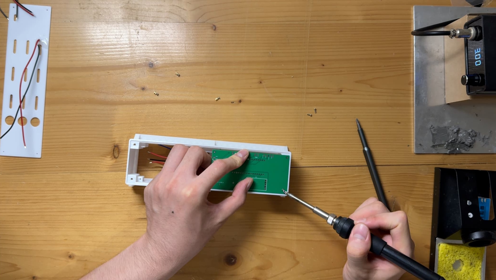

# PixelClock ピクセルクロック
ハンダ付け

## 目次

### ハンダ付け前の情報
- 換気
- マスクを着用 😷
- ハンダごて温度
	- 中温はんだペースト 240度
	- はんだ線高温 300度
	- ナット圧入 300度または350度

### 光敏部品のハンダ付けと裏蓋への接着
- 被覆剥き (ワイヤーの片側の被覆を剥く)
- ワイヤーを光敏部品のピンに巻き付ける
- はんだペーストを塗布、2本のワイヤーを光敏部品にハンダ付けする
- 光敏部品のピンの一部を切断する
- 保護のために706接着剤を少し塗布する

### ボタン
- はんだ線 (中温 高温はんだペーストでも可)
- 12mm高頭ボタン 3個
	- ナットを締め付ける (これによりハンダ付け時に転がらない)
	- ボタン側の2本のワイヤーのみハンダ付けする
- 16mm円形ライト付きフラットボタン 1個
	- 
	- この視点から見て、白-左、赤-右、黒-中、黄-下

### ナット圧入
- ケースをナット圧入スタンドに置く
	- スタンド
- ネジと銅ナットを締め付ける
	- 
	- ネジの最も長い端がちょうどナットの中にあるように保つ
- ハンダごて 350度
- 
- PCBを裏蓋にしっかりはめ込み、順に4つのナットを圧入する (5mm長M1.6ネジ、3mm高M1.6ナット)
- メインボード固定用の2つのナットも同様に行う (4mm長M1.6ネジ、2mm高M1.6ナット)

### ESP32C3ピンヘッダのハンダ付け
- ピンヘッダをメインボードPCBに置く
- ESP32 C3をピンヘッダの上に置く
- はんだペーストでハンダ付けする (または最初にフラックスを加え、次にはんだを加えてハンダ付けする)

### LEDのハンダ付け
- 中温はんだペースト (または高温はんだペースト)
- 2つの方法
	- LEDボードPCBにはんだペーストを手作業で塗布する
	- メタルマスク
- LEDを配置する
	- 左上の「1」とLEDの切り欠きも左上に揃える
	- 
- ホットプレートに置く
	- 完全に溶融したら取り外す
- LEDボードのテスト
	- テスト用LEDビーズファームウェアを書き込む必要がある
	- デュポン線を使用する (オス-メス 15CM長)
	- 
	- ESP32-C3 GND, 5V, IO06に接続する
	- LEDボード GND, VCC, IN
- LEDが点灯しない場合
	- 点灯しないLEDと、その前のLEDがショートしているか、またはハンダ不良がないか確認する
- LEDボードを接続して再度テスト
	- LEDボードを接続する
	- LEDボードとESP32-C3を接続する

### メインボードPCB
- 5.1k抵抗
	- 2つのSMD抵抗の位置にはんだペーストを加える
	- ホットプレートに入れる (ハンダごてでも可)
- 10k抵抗
	- 1つのSMD抵抗の位置にはんだペーストを加える
	- ハンダごてでハンダ付けする
- Type-Cコネクタ
	- コネクタの切り欠きは外側に向ける
	- フラックスを少し加える
	- ピンをハンダ付けするだけで良い
- 電源コネクタのハンダ付け
- ボタンコネクタ3個のハンダ付け
- 光敏コネクタ1個のハンダ付け
- ESP32-C3用ソケット2個のハンダ付け
	- ソケットを挿入することから始める、フラックスを少し加える
	- ハンダ付けするだけで良い
	- GNDピンのハンダ付け
- パッシブブザー
	- 「+」 (プラス) マークは左側
	- PCBとハンダ付けする
- マイクモジュール
	- ソケットに斜めに挿入する
	- まずソケットをハンダ付けする
	- 次にマイクモジュール上のピンヘッダをハンダ付けする
- 淘宝でモジュールを購入するかどうか
	- はい、淘宝クロックモジュール
		- ピンヘッダをまっすぐにして、メインボードに挿入しハンダ付けする
	- いいえ、自分で作成する
		- クロックリンクとソケットを一緒に接続する
		- メインボードに挿入しハンダ付けする
- AMS1117エリア
	- ハンダ付け不要