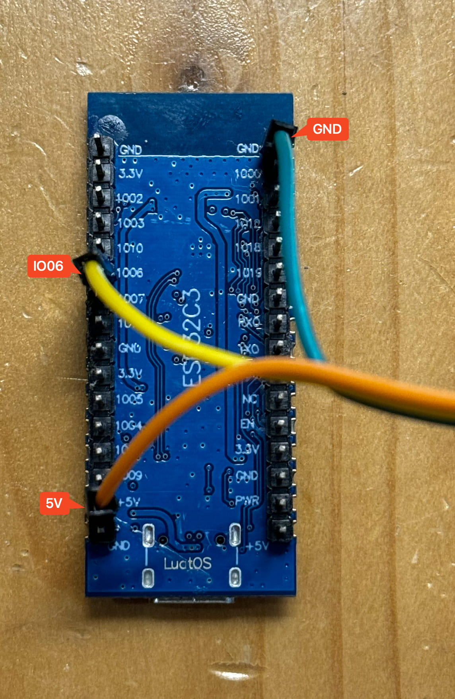

# PixelClock像素时钟  
  焊接

## 目录

### 焊接前的信息
- 开窗
- 戴口罩 😷
- 电铬铁焊接的温度
	- 中温锡膏 240度
	- 锡线高温 300度
	- 压螺母 300度或350度

### 焊接和粘光敏元件到后盖上
- 剥线(剥掉一头的线)
- 线缠绕在光敏引脚上
- 涂锡膏, 2根线焊接光敏元件
- 剪掉一部分光敏元件引脚
- 涂一点706保护一下

### 按钮
- 锡丝 (中温 高温锡膏也行)
- 3个12mm 高头按钮
	- 拧上螺母(这样焊接的时候不会滚动)
	- 只焊接接按钮端的2根线
- 1个16mm 圆形带灯平台按钮
	- 
	- 这个视角下, 白色-左  红色-右  黑色-中 黄色-下

### 压入螺母
- 外壳放在压螺母支架上
	- 支架
- 拧好螺丝和铜螺母
	- 
	- 保持螺丝最长端刚刚好在螺母内
- 烙铁350度
- 
- 扣好PCB到后盖处, 依次压入4个螺母(5mm长螺丝M1.6, 3mm长螺母M1.6)
- 固定主板的两个螺母也是如此(4mm长螺丝M1.6, 2mm长螺母M1.6)

### 焊接ESP32C3针脚
- 针脚放到主板PCB上
- EPS32 C3放到针脚上
- 锡膏焊接(或先加助焊剂再加锡来焊接)

### 焊接灯珠
- 中温锡膏(或高温锡膏)
- 两种方式
	- 手剂锡膏到灯板PCB上
	- 钢网
- 放置灯珠
	- 左上角有1 与 灯珠的缺角也保持左上角
	- 
- 放到加热台
	- 完全熔化即可拿下来
- 测试灯板
	- 要刷入测试灯板珠的固件
	- 使用杜邦线(公对母 15CM长度)
	- 
	- 连接ESP32-C3 GND 5V I006
	- 灯板 GDN VCC IN
- 如果灯珠不亮
	- 检查不亮的灯和不亮灯前面一个灯是否连锡或虚焊
- 连接灯板再次测试
	- 连接灯板
	- 连接灯板和ESP32-C3

### 主板PCB
- 5.1k电阻
	- 2个贴片电阻位置加锡膏
	- 放入加热台(用铬铁也可)
- 10k电阻
	- 1个贴片电阻位置加锡膏
	- 电铬铁焊接
-  Type-C插件
	- 插件缺口方向对外
	- 加一点助焊剂
	- 螺丝焊接即可
- 电源插件焊接
- 3个按钮插件焊接
- 1个光敏插件焊接
- ESP32-C3两个排母焊接
	- 插入排母开始, 加一点助焊剂
	- 焊接即可
	- GND引脚焊接
- 无源蜂鸣器
	- +(正)号在左
	- 与PCB焊接
- 拾音模块
	- 斜着插入排母
	- 先焊接排母
	- 再焊接拾音模块上的排针
- 是否淘宝购买模块
	- 是, 淘宝时钟模块
		- 排针变直,插入主板并焊接
	- 否, 自己制作
		- 时钟链接和排母连接一起
		- 插入主板并焊接
- AMS1117区域
	- 无须焊接
