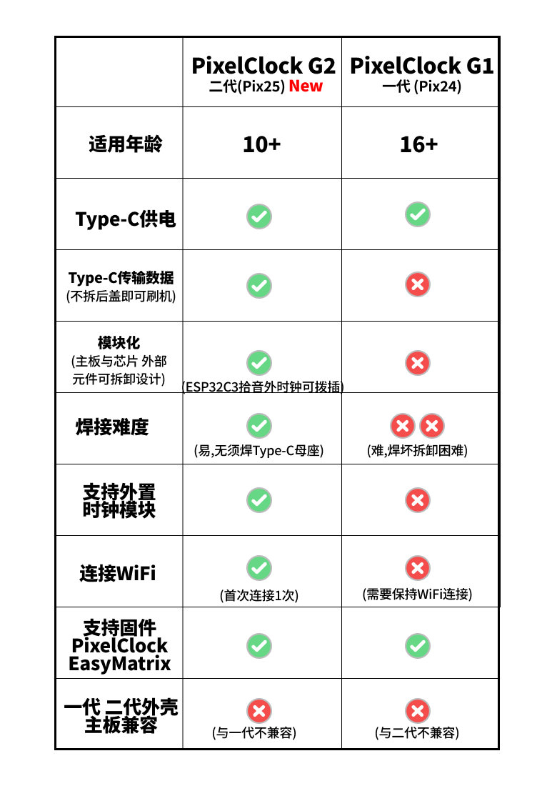

# PixelClock 像素时钟

#### PixelClock 像素时钟是一款使用ESP32-C3、32x8像素屏、拾音模块、蜂鸣器组装的，具备显示时间 、音乐拾音、闹钟、像素动画功能。

## 禁止商用

## PixelClock G2 像素时钟二代 vs PixelClock G1 像素时钟一代

# 像素时钟 PixelClock G2 二代

## (三) 像素时钟 PixelClock G2 材料与工具

[像素时钟 PixelClock G2 材料和工具.md 文档](Document/PixelClock_G2/PixelClock像素时钟G2三材料和工具.md)

[像素时钟 PixelClock G2 材料和工具.jpg 图片](Document/PixelClock_G2/PixelClock像素时钟G2三材料和工具.jpg)

## 常用文件夹链接

#### [驱动Driver 文件夹](Driver)

#### [固件Firmware 文件夹](Firmware)

#### [Gerber PCB打样文件夹](Gerber)

# 像素时钟 PixelClock G1 一代

## 一 PixelClock G1(一代) 展示

[PixelClock像素时钟(一) 展示 B站视频](https://www.bilibili.com/video/BV1yrxTeEETV/)

[PixelClock像素时钟(一) 展示.md 文档](Document/PixelClock_G1/PixelClock像素时钟一展示.md)

[PixelClock像素时钟(一) 展示.jpg 图片](Document/PixelClock_G1/PixelClock像素时钟一展示.jpg)

## 二 PixelClock G1(一代) 材料和工具

[PixelClock像素时钟(二) 材料和工具 B站视频](https://www.bilibili.com/video/BV1NT421z7xP/)

[PixelClock像素时钟(二) 材料和工具.md 文档](Document/PixelClock_G1/PixelClock像素时钟二材料和工具.md)

[PixelClock像素时钟(二) 材料和工具.jpg 图片](Document/PixelClock_G1/PixelClock像素时钟二材料和工具.jpg)

## 三 PixelClock G1(一代) 刷入ESP32-C3 固件

[PixelClock像素时钟(三) 刷入ESP32-C3固件 B站视频](https://www.bilibili.com/video/BV1JsxmepETZ/)

[PixelClock像素时钟(三) 写入固件.md 文档](Document/PixelClock_G1/PixelClock像素时钟三写入固件.md)

[PixelClock像素时钟(三) 写入固件.jpg 图片](Document/PixelClock_G1/PixelClock像素时钟三写入固件.jpg)

## 四 PixelClock G1(一代) 焊接和组装

[PixelClock像素时钟(四) 焊接和组装 B站视频](https://www.bilibili.com/video/BV1R22kYeEFm/)

[PixelClock像素时钟(四) 焊接和组装.md 文档](Document/PixelClock_G1/PixelClock像素时钟四焊接和组装.md)

[PixelClock像素时钟(四) 焊接和组装.jpg 图片](Document/PixelClock_G1/PixelClock像素时钟四焊接和组装.jpg)
