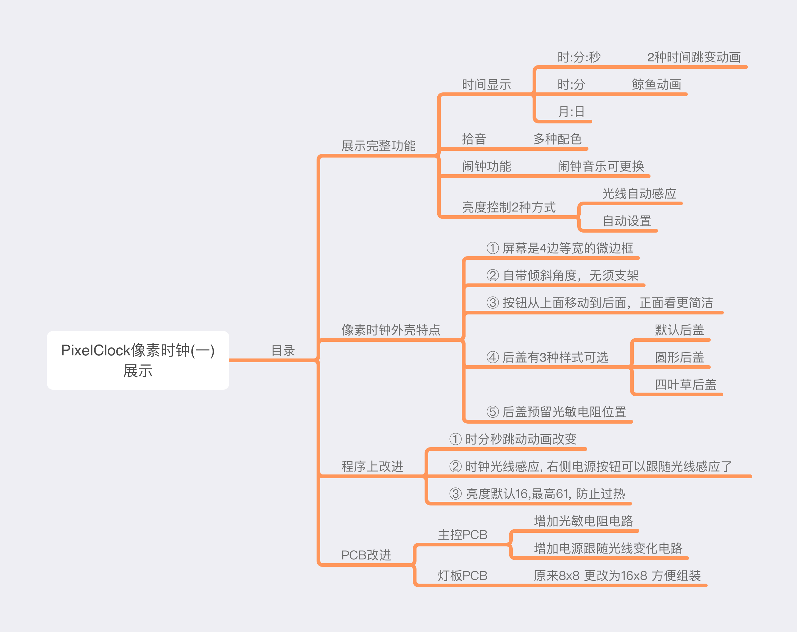
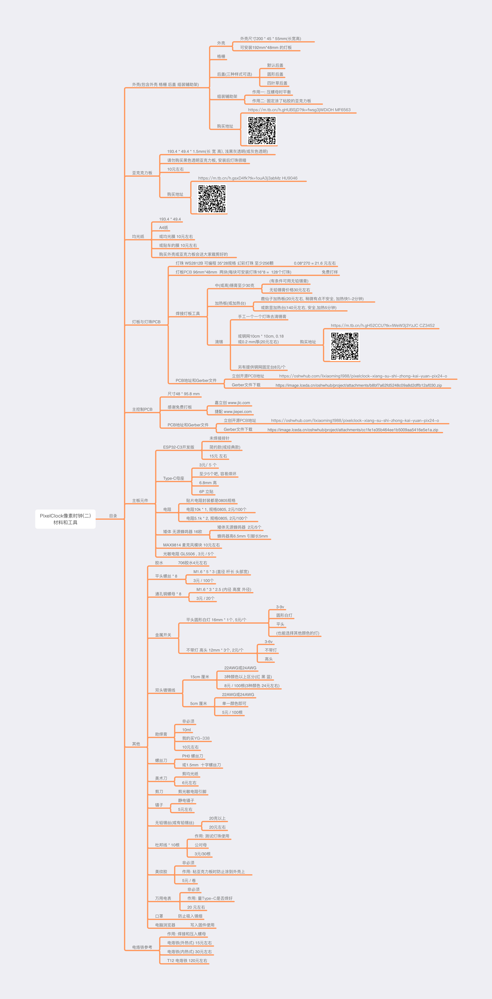
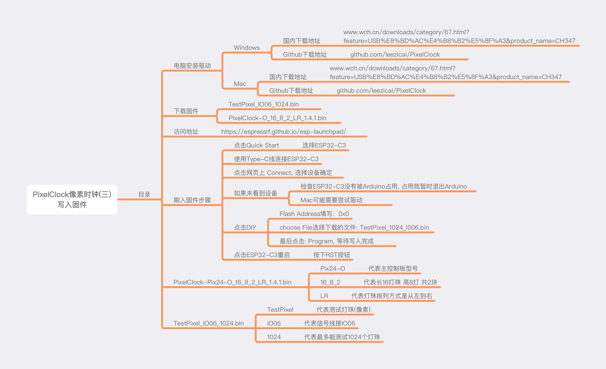
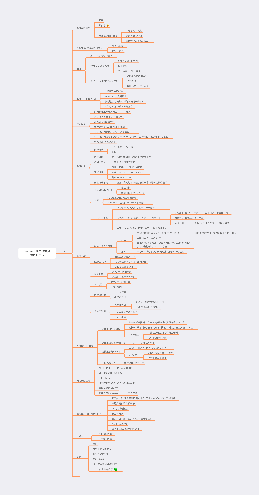

## PixelClock 像素时钟

## 禁止商用

### 闲鱼: 小新数码乐园
#### 外壳为新设计, 固件和PCB均修改自大聪明老师.

## 目录

### 一 PixelClock像素时钟 展示

### 二 材料和工具

### 三 刷入ESP32-C3固件

### 四 焊接和组装

## 一 PixelClock 像素时钟展示

## 二 材料和工具

## 三 刷入ESP32-C3 固件

## 四 焊接和组装

